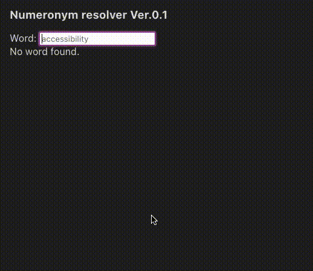

# en-numeronym-web
Lists a numeronym and words with the same numeronym, for a given English word. 



## Run locally
```bash
npm run dev
```

## Run unit tests
```bash
npm run test
```

## Build for production
```bash
npm run build
```

## Appendix: updating english words
1. fetch index.json from https://github.com/words/an-array-of-english-words
2. rename index.json to bin/words.json
3. run `npm run prepareWords`
4. move `wordsLut.json` to the public folder
```
